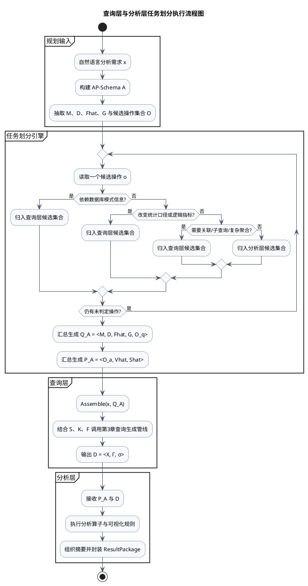
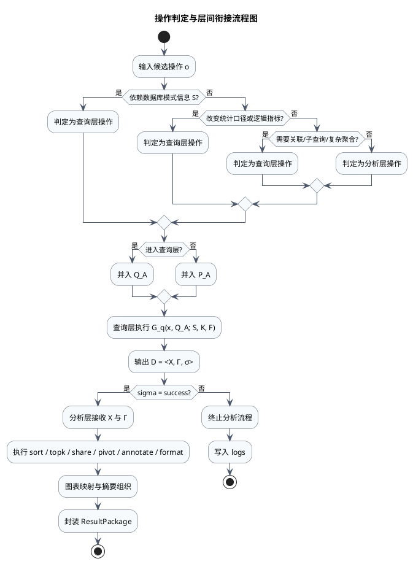

# 第4章相关图设计提示词

依据文件：
- `content/mychap03.tex`
- `content/mychap04.tex`

论文题目：面向政务领域的大模型数据查询与分析方法研究与实现

说明：
1. 本文件只整理绘图提示词与流程代码，不修改原始论文内容。
2. `fig:chap04_framework` 更适合作为学术理论图中的“方法总览图/系统架构图”。
3. `fig:chap04_partition_framework` 与 `fig:chap04_decision_flow` 都属于工程流程图，除提示词外补充 PlantUML 活动图代码。
4. 这些提示词更适合先生成结构草图，再用 draw.io、Visio、Figma 或 TikZ 重绘成论文终稿。

---

## 1. 分析规划与查询增强协同数据分析框架图

对应图注：
- `\caption{分析规划与查询增强协同数据分析框架图}\label{fig:chap04_framework}`

图类型判断：
- 学术理论图
- 更准确地说，是“方法总览图/系统架构图/研究框架图”，不建议画成强调判断菱形的传统流程图。

判断依据：
- 这张图的核心任务是概括第4章整体方法及其与第3章查询生成管线的协同关系。
- 图中重点是模块分层、信息流和接口定义，而不是某一步骤内部的条件分支。
- 需要突出 AP-Schema、查询增强复用、标准结果表示 `\mathcal{D}` 与结果包 `ResultPackage` 四个关键机制。

### 图结构说明

建议采用“从左到右的分层总览布局”，整体分为五段：

1. 输入层：自然语言分析需求 `x`。
2. 规划层：需求解析、AP-Schema 构建。
3. 双投影层：从 AP-Schema 分解出查询需求投影 `Q_A = \pi_q(A)` 与分析需求投影 `P_A = \pi_a(A)`。
4. 协同执行层：
   - 查询侧：`Q_A` 与原始需求共同构造查询子问题，结合数据库模式 `S`、领域知识库 `K`、动态样例库 `F`，进入第3章查询生成管线。
   - 分析侧：查询侧返回标准结果表示 `\mathcal{D} = \langle \mathbf{X}, \Gamma, \sigma \rangle` 后，分析层基于 `P_A` 执行轻量分析算子、图表决策与摘要组织。
5. 输出层：`ResultPackage = {charts, tables, insights, logs}`。

画面中建议突出两个接口：
- 接口1：`Q_A / P_A`，表示“规划后再分工”。
- 接口2：`\mathcal{D} = \langle \mathbf{X}, \Gamma, \sigma \rangle`，表示“查询层与分析层之间的标准化衔接”。

第3章查询增强管线建议作为一个带子模块的组合框出现，内部可弱化展示：
- LA-Schema 模式链接
- 异构候选生成
- 执行反馈修复
- 候选判别
- 数据库执行

### 中文绘图提示词

你是一名硕士学位论文图示设计助手。请根据以下内容生成一张“研究框架图/系统架构图”。

【论文信息】
- 论文题目：面向政务领域的大模型数据查询与分析方法研究与实现
- 图名：分析规划与查询增强协同数据分析框架图
- 图用途：用于第4章方法总览，展示分析规划、查询增强取数与结果生成之间的协同关系
- 输入：自然语言分析需求 `x`
- 输出：`ResultPackage = {charts, tables, insights, logs}`
- 核心创新点：AP-Schema 分析规划；查询需求投影与分析需求投影；复用第3章可靠查询生成管线；标准结果表示 `\mathcal{D} = <X, Γ, σ>`；轻量分析算子与可视化规则

【需要表达的模块】
- 自然语言分析需求
- 需求解析
- AP-Schema 构建
- 查询需求投影 `Q_A = π_q(A)`
- 分析需求投影 `P_A = π_a(A)`
- 查询子问题组装 `Assemble(x, Q_A)`
- 第3章查询生成管线
- 标准结果表示 `\mathcal{D} = <X, Γ, σ>`
- 分析算子执行与可视化决策
- 结果封装 `ResultPackage`

【第3章查询生成管线内部子模块】
- LA-Schema 模式链接
- 异构候选生成
- 执行反馈修复
- 候选判别
- 数据库执行

【模块关系】
- 自然语言分析需求 `x` -> 需求解析 -> AP-Schema 构建
- AP-Schema -> 分裂为 `Q_A` 与 `P_A`
- `Q_A` + 原始需求 `x` + 数据库模式 `S` + 领域知识库 `K` + 动态样例库 `F` -> 第3章查询生成管线
- 查询生成管线 -> 返回 `\mathcal{D} = <X, Γ, σ>`
- `P_A` + `\mathcal{D}` -> 分析算子执行、可视化规则、摘要组织
- 最终输出 `ResultPackage`

【绘图目标】
- 清晰体现第4章并不直接自由生成 SQL，而是通过 AP-Schema 先规划、再调用第3章查询管线完成可靠取数
- 突出“规划层”和“执行层”分工，以及“查询层负责正确取数、分析层负责规范生成”的职责边界
- 让读者一眼看出本章与第3章的衔接关系

【画图要求】
- 图类型：研究框架图 / 方法总览图 / 系统架构图
- 布局方式：从左到右的分层结构，必要时在中部使用双分支再汇合
- 白底，低饱和配色，建议使用深灰、藏蓝、墨绿三色
- 线条简洁，箭头明确，适合硕士论文排版
- AP-Schema、`Q_A/P_A`、`\mathcal{D}` 这三个关键节点可适度强调，但不要使用海报式夸张高亮
- 第3章查询生成管线可以作为一个组合框，内部用较小模块表示子步骤
- 图中文字精炼，优先使用短语，不要出现大段说明性句子
- 禁止产品海报风、3D 风格、过度装饰、拟物图标

【输出偏好】
- 输出一张适合论文正文插图的矢量风格结构图
- 如果需要增加说明，请在图下方保留极简公式标签：`Q_A = π_q(A)`、`P_A = π_a(A)`、`\mathcal{D} = <X, Γ, σ>`

### 建议图注

分析规划首先将自然语言需求转化为 AP-Schema，并进一步分解为查询约束与分析约束；查询层复用第3章可靠取数管线返回标准结果表示，分析层据此完成规范化结果生成。

---

## 2. 查询层与分析层任务划分执行流程图

对应图注：
- `\caption{查询层与分析层任务划分执行流程图}\label{fig:chap04_partition_framework}`

图类型判断：
- 工程流程图
- 更准确地说，是“分层执行流程图/双层泳道流程图”。

判断依据：
- 文中明确给出了“四步执行流程”，并强调从 AP-Schema 中抽取候选约束、逐项判定、汇总投影、分层执行。
- 该图需要展示流程先后顺序、任务流转路径和层间传递对象，属于典型工程流程表达。
- 需要把“查询层”和“分析层”区分为不同泳道或分层区块。

### 图结构说明

建议采用“自上而下 + 双泳道”的布局：

1. 起点：自然语言分析需求与 AP-Schema。
2. 任务抽取：从 AP-Schema 中抽取指标、维度、筛选条件、粒度和候选操作。
3. 判定阶段：围绕模式依赖性、统计口径依赖性、查询结构复杂性，对候选操作逐项判断归属。
4. 汇总阶段：
   - 满足查询层条件的操作汇总为 `Q_A = <M, D, \hat{F}, G, O_q>`
   - 仅面向结果组织的操作汇总为 `P_A = <O_a, \hat{V}, \hat{S}>`
5. 查询层泳道：`Q_A` 与原始需求、`S/K/F` 一起送入第3章查询生成管线，输出 `\mathcal{D}`。
6. 分析层泳道：`P_A` 与 `\mathcal{D}` 合流，执行分析算子调用、可视化映射和摘要生成，输出 `ResultPackage`。

这张图应突出三个视觉重点：
- AP-Schema 是任务划分的输入中心
- `Q_A` 与 `P_A` 是划分结果
- `\mathcal{D}` 是层间接口

### 中文绘图提示词

你是一名学术论文流程图助手。请将下面的研究过程转换为适合硕士论文的标准流程图。

【论文信息】
- 论文题目：面向政务领域的大模型数据查询与分析方法研究与实现
- 流程名称：查询层与分析层任务划分执行流程图
- 流程目标：说明系统如何从 AP-Schema 中抽取候选约束，并把操作分配给查询层或分析层，再完成层间协同执行

【流程步骤】
- 开始：输入自然语言分析需求并得到 AP-Schema
- 步骤1：从 AP-Schema 中抽取指标、维度、筛选条件、粒度和候选操作
- 步骤2：逐项检查候选操作是否依赖数据库模式、是否改变统计口径、是否需要复杂查询结构
- 步骤3：将满足查询层条件的部分汇总为 `Q_A`，将仅依赖结果组织的部分汇总为 `P_A`
- 步骤4：`Q_A` 与原始需求、数据库模式 `S`、领域知识库 `K`、动态样例库 `F` 共同进入第3章查询生成管线
- 步骤5：查询层输出标准结果表示 `\mathcal{D} = <X, Γ, σ>`
- 步骤6：分析层基于 `P_A` 与 `\mathcal{D}` 执行算子、可视化和摘要组织
- 结束：输出 `ResultPackage`

【要求】
- 图类型：工程流程图 / 双泳道流程图
- 版式建议：上部为任务划分引擎，下部为查询层与分析层两条泳道，整体自上而下
- 开始和结束节点明确
- 中间要体现“逐项判定”的过程，不要直接从 AP-Schema 跳到 `Q_A/P_A`
- 查询层与分析层用不同底色淡框区分，但保持低饱和论文风格
- 关键接口 `Q_A`、`P_A`、`\mathcal{D}` 使用统一数学符号
- 白底、矢量风格、低饱和配色、中文标签、适合论文排版
- 不要卡通图标，不要产品宣传风，不要复杂阴影

### PlantUML 代码

### 建议图注

系统先从 AP-Schema 中抽取并判定候选操作的层级归属，随后形成查询需求投影与分析需求投影，并通过标准结果表示完成查询层与分析层的协同执行。

---

## 3. 操作判定与层间衔接流程图

对应图注：
- `\caption{操作判定与层间衔接流程图}\label{fig:chap04_decision_flow}`

图类型判断：
- 工程流程图
- 更准确地说，是“判定流程图 + 层间接口衔接图”。

判断依据：
- 本图直接对应公式 `\phi(o)` 的层级判定规则，天然属于带决策节点的流程图。
- 图中除了判定操作归属，还需要继续展示查询层输出 `\mathcal{D}` 后如何驱动分析层，因此是“判定 + 衔接”的复合流程。
- 该图的核心不是模块总览，而是条件判断、分支归属和失败/成功控制逻辑。

### 图结构说明

建议采用“中心判定树 + 右侧接口流”的布局：

1. 起点：候选操作 `o`。
2. 三个主判定节点：
   - 是否依赖数据库模式信息 `S`
   - 是否改变统计口径或逻辑指标
   - 是否需要跨表关联、子查询或复杂聚合
3. 若任一条件为“是”，则判定该操作进入查询层；否则进入分析层。
4. 查询层负责形成 `Q_A` 并调用第3章查询生成管线，输出 `\mathcal{D} = <X, Γ, σ>`。
5. 对 `σ` 进行执行状态检查：
   - 若 `σ = failure`，则终止分析并写入日志
   - 若 `σ = success`，则把 `\mathbf{X}` 与 `\Gamma` 传给分析层
6. 分析层执行排序、占比、透视、标注、格式化等算子，再完成图表映射与文字洞察生成。

这张图的重点不在“所有模块都画全”，而在于突出四件事：
- 判定维度
- 查询层优先原则
- `\mathcal{D}` 的标准接口含义
- `σ` 对流程继续或终止的控制作用

### 中文绘图提示词

你是一名学术论文流程图助手。请根据以下内容生成一张“操作判定与层间衔接流程图”。

【论文信息】
- 论文题目：面向政务领域的大模型数据查询与分析方法研究与实现
- 流程名称：操作判定与层间衔接流程图
- 图用途：解释单个候选操作如何被判定归入查询层或分析层，并展示查询层返回结果表示后如何衔接分析层

【流程逻辑】
- 开始：输入候选操作 `o`
- 判断1：该操作是否依赖数据库模式信息
- 判断2：该操作是否改变统计口径或逻辑指标
- 判断3：该操作是否需要关联、子查询或复杂聚合
- 若任一判断为“是”：归入查询层
- 若均为“否”：归入分析层
- 查询层后续：进入受约束查询意图执行过程，输出 `\mathcal{D} = <X, Γ, σ>`
- 判断4：`σ` 是否为 `success`
- 若否：终止分析流程，记录日志
- 若是：分析层基于结果集和字段元数据执行排序、透视、占比、标注、格式化，并完成可视化与摘要生成
- 结束：输出结果包

【绘图要求】
- 图类型：标准流程图 / 判定流程图
- 白底、低饱和、中文标签、论文风格
- 判断节点使用菱形，处理节点使用矩形，开始和结束节点明确
- 强调“查询层保证数据正确性，分析层保证表达规范性”的职责边界
- `\mathcal{D} = <X, Γ, σ>` 节点应清楚展示它由数据结果、字段元数据和执行状态三部分组成
- 可在分析层节点中点到为止地列出轻量算子：`sort`、`topk`、`share`、`pivot`、`annotate`、`format`
- 画面整体简洁、理性、工程化，适合硕士论文插图

### PlantUML 代码

### 建议图注

系统依据模式依赖性、统计口径依赖性和查询结构复杂性判定操作归属，并通过标准结果表示 `\mathcal{D}` 完成查询层到分析层的可靠衔接。
